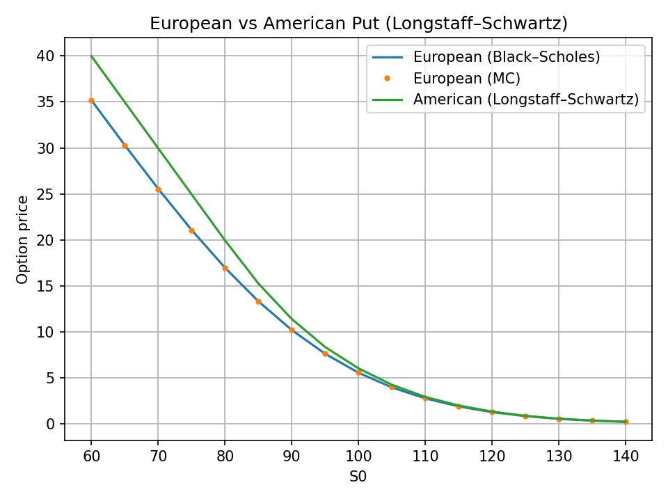
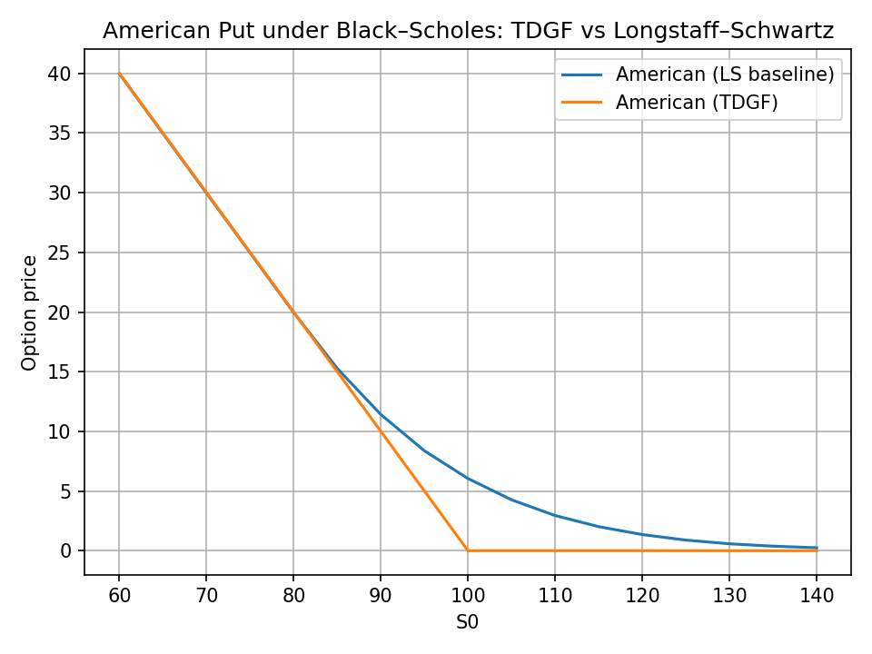

# TDGF American Options

A compact project to price American options under Black–Scholes using:

- **Baseline**: Monte Carlo (MC) + Longstaff–Schwartz (LS)
- **Neural PDE**: Time Deep Gradient Flow (TDGF) with a payoff-preserving network

## Phases
- **Phase 1** — European option (MC baseline)
- **Phase 2** — American option (LS baseline)
- **Phase 3** — TDGF (1D American put) (needs tailoring)
- **Phase 4** — 2D Basket (stretch)

# References:
- https://arxiv.org/search/?query=Time+Deep+Gradient+Flow+Method+for+Pricing+American+Options&searchtype=all&source=header
- https://arxiv.org/abs/2507.17606


## Quickstart
```bash

python -m venv .venv
source .venv/bin/activate            # Windows: .venv\Scripts\activate
python -m pip install --upgrade pip
pip install numpy pandas matplotlib scipy scikit-learn torch
python3 experiments/bs1d_euro_quickstart.py
```


## Results

The experiments produce plots saved under `experiments/img/`.

### Phase 2 — European vs American Put
Comparison between Black–Scholes closed form, Monte Carlo, and Longstaff–Schwartz baseline.  


### Phase 3 — TDGF vs Longstaff–Schwartz
Comparison between neural solver (TDGF) and Monte Carlo regression baseline.  
